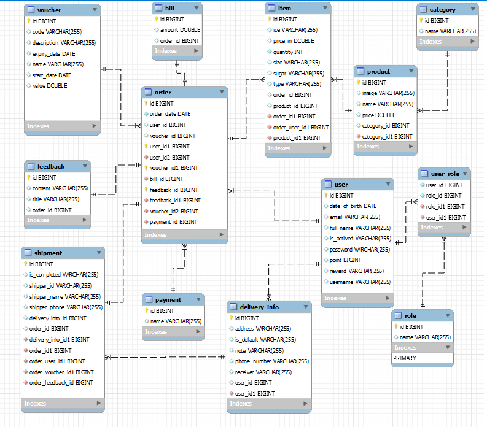
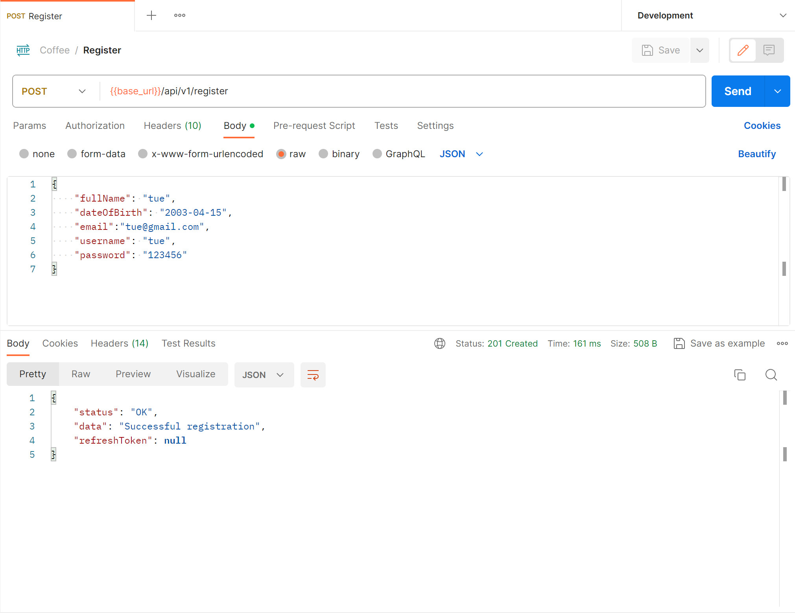
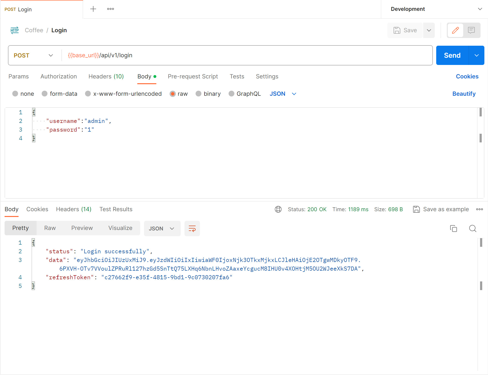
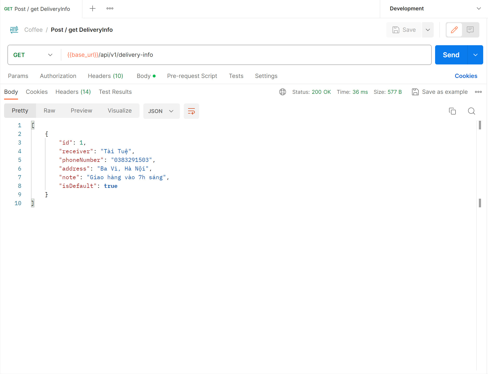
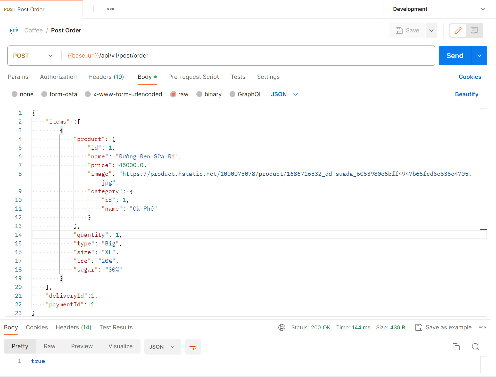
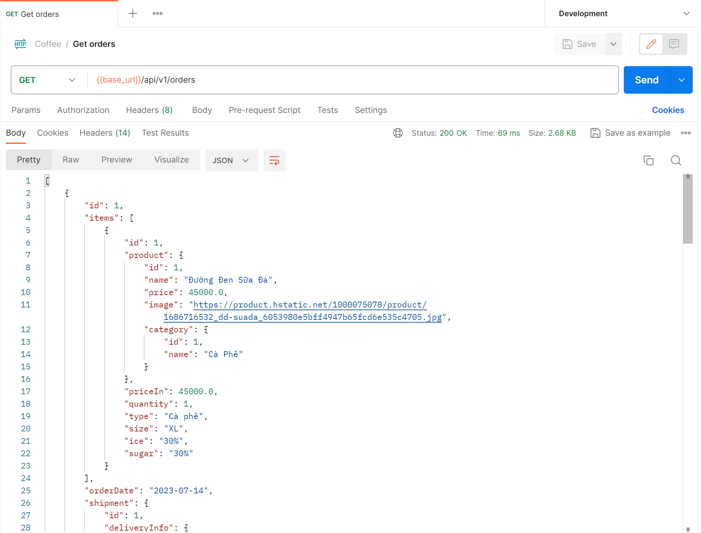
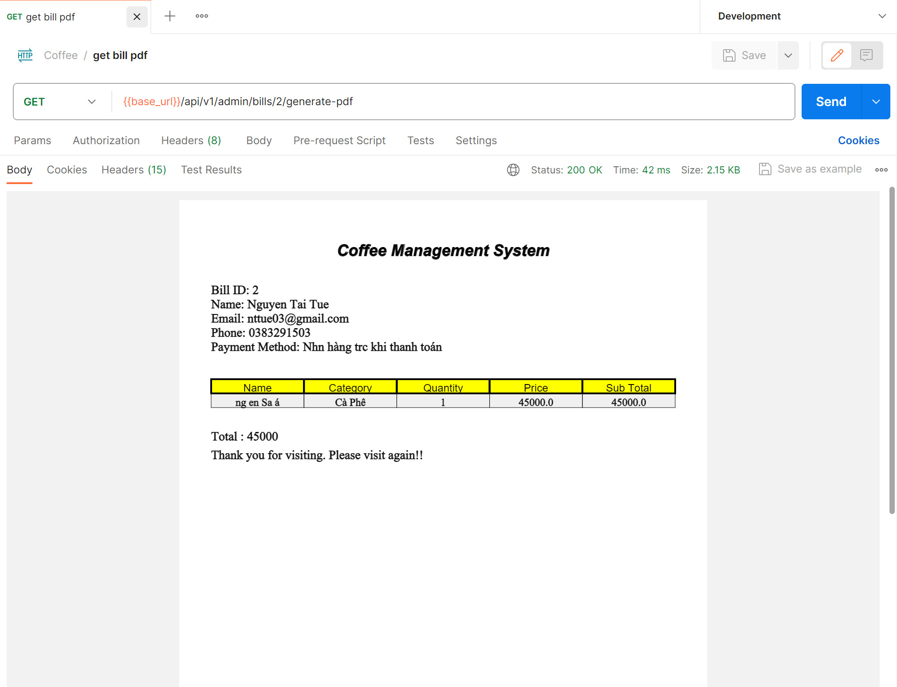
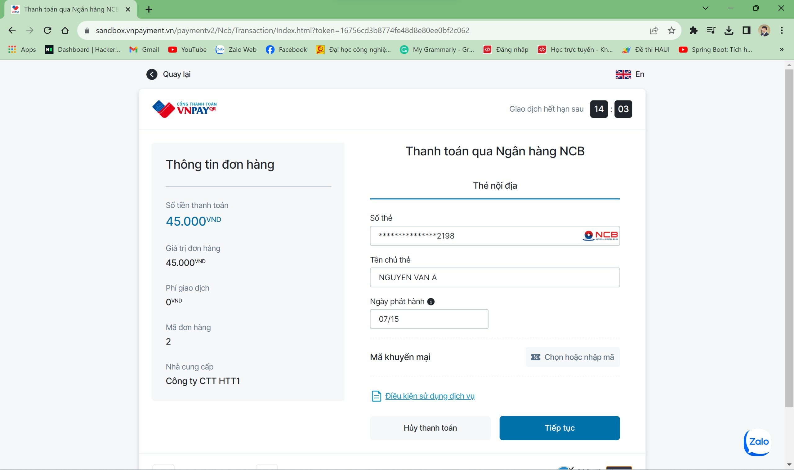
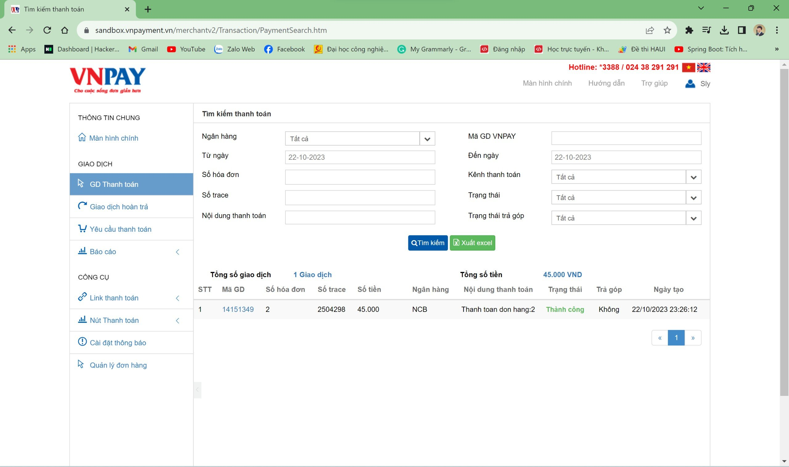
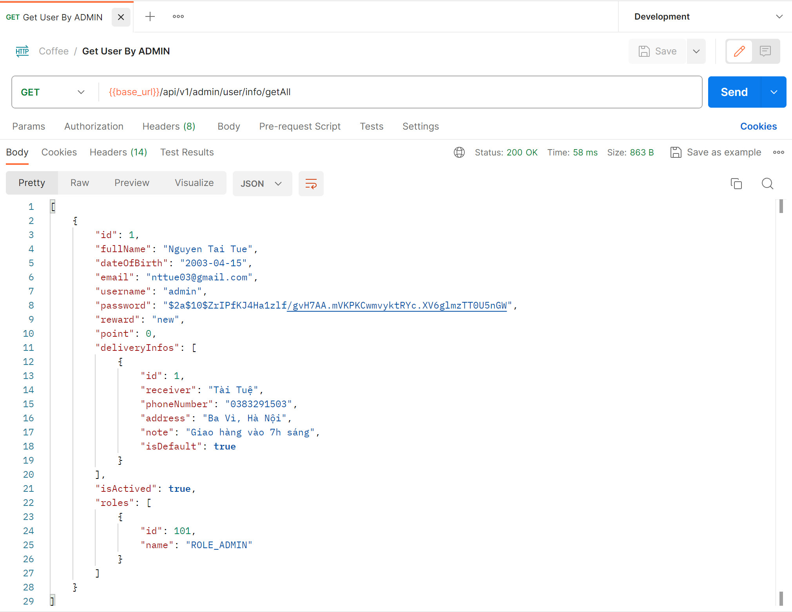

# REST API for Coffeehome Website

## Introduction
  RESTful API for managing coffeehome functions such as managing orders, users and online payment.... The project uses Spring framework.
  
## Database
*Diagram*

## Features
### 1. View Products

### 2. Register

### 3. Login

### 4. Receiver information

### 5. Order

### 6. View Ordered

### 7. Get the bill in pdf file

### 8. Online Payment

- *Return URL*

- *Enter card information*

- *Vertify OTP*

- *Transaction management*

### 9. Confirmation of delivered order by shipper

### 10. Manage user information
  CRUD user by admin

## Getting Started

### Requirements
- Spring boot: 2.5.3
- Java SDK: 11
- Maven 
- MySQL 8.0
- Postman
### Install
- Install Java
    https://www.oracle.com/java/technologies/javase/jdk11-archive-downloads.html
- Install Spring boot project
    https://start.spring.io/
- Install IntelliJ IDEA
    https://www.jetbrains.com/idea/download/?section=windows
- Install MySQL
    https://dev.mysql.com/downloads/
- Install Postman
    https://www.postman.com/downloads/

