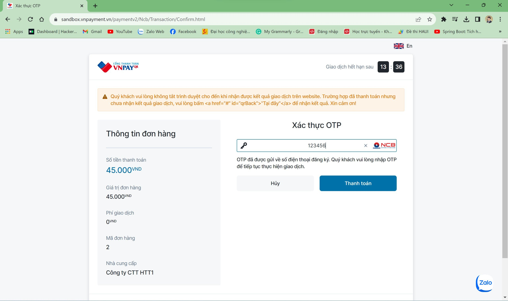

# REST API for Coffeehome Website

## Database

## Features

### 1. View Products

### 2. Register

### 3. Login

### 4. Receiver information

### 5. Order

### 6. View Ordered

### 7. Get the bill in pdf file

### 8. Online Payment

*Return URL*

*Enter card information*

*Vertify OTP*

*Transaction management*

### 9. Confirmation of delivered order by shipper

### 10. Manage user information
CRUD user by admin

## Getting Started

### Requirements
